# KeySwitch

<p align="center"></p>

<p align="center">
  <a href="https://github.com/vadimpokrov396-ship-it/keyswitch/actions/workflows/ci.yml"></a>
  <a href="https://github.com/vadimpokrov396-ship-it/keyswitch/releases/latest"></a>
  
  
  <a href="LICENSE"></a>
</p>

<h3 align="center">Набрали <code>ghbdtn</code> — получили <code>привет</code>. Автоматически, офлайн, бесплатно.</h3>

<p align="center">
  <a href="https://github.com/vadimpokrov396-ship-it/keyswitch/releases/latest/download/KeySwitch-win-x64.zip"></a>
  &nbsp;
  <a href="https://github.com/vadimpokrov396-ship-it/keyswitch/releases/latest/download/KeySwitch-small.zip"></a>
</p>
<p align="center"><sub>Кнопки скачивают zip сразу. Полная версия работает без установки чего-либо; лёгкой нужен <a href="https://dotnet.microsoft.com/en-us/download/dotnet/8">.NET 8 Desktop Runtime x64</a>. Контрольные суммы: <a href="https://github.com/vadimpokrov396-ship-it/keyswitch/releases/latest/download/SHA256SUMS-all">SHA256SUMS-all</a>.</sub></p>

---


Автоматический переключатель раскладки RU ⇄ EN для Windows 10/11 x64. Если вы набрали `ghbdtn`, забыв переключить раскладку, KeySwitch по пробелу заменит слово на `привет` и сам переключит раскладку. Заодно он исправляет частые опечатки (`becuase` → `because`).

- Работает из системного трея, без установщика: распаковал и запустил.
- Автоисправление полностью офлайн: без телеметрии, набранный текст не пишется на диск.
- Точность важнее охвата: на отложенном корпусе precision переключения 99,4%, ложные срабатывания на правильном тексте около 0,07%.
- Не трогает поля паролей, исключённые приложения (по умолчанию `mstsc.exe`, `KeePass.exe`), полноэкранные окна и активный IME.
- Проверка грамматики выделенного текста через LanguageTool — только по горячей клавише и после явного согласия.

Подробное руководство пользователя: [README_RU.md](README_RU.md).

## Как скачать для Windows

### Вариант 1. Прямые ссылки (рекомендуется)

Нажмите на файл — скачивание начнётся сразу, без перехода на другие страницы:

| Файл | Размер | Что нужно |
| --- | ---: | --- |
| [`KeySwitch-win-x64.zip`](https://github.com/vadimpokrov396-ship-it/keyswitch/releases/latest/download/KeySwitch-win-x64.zip) | ~80 МБ | Ничего, .NET уже внутри. Выбирайте, если не уверены. |
| [`KeySwitch-small.zip`](https://github.com/vadimpokrov396-ship-it/keyswitch/releases/latest/download/KeySwitch-small.zip) | ~14 МБ | Установленный [.NET 8 Desktop Runtime x64](https://dotnet.microsoft.com/en-us/download/dotnet/8) (именно Desktop Runtime). |

Функции и модель у обеих сборок одинаковые. Релиз создаётся автоматически при публикации тега `v*`, например `v1.2.0`.

### Вариант 2. Свежая сборка из CI

Каждый push собирается и проверяется на Windows в GitHub Actions. Чтобы скачать сборку, которая ещё не попала в релиз:

1. Откройте [Actions → CI](https://github.com/vadimpokrov396-ship-it/keyswitch/actions/workflows/ci.yml) (нужно войти в GitHub).
2. Выберите последний запуск с зелёной галочкой.
3. Внизу страницы, в блоке **Artifacts**, скачайте `packages`.
4. Внутри `packages.zip` лежат те же `KeySwitch-win-x64.zip` и `KeySwitch-small.zip`.

Артефакты хранятся 90 дней.

### Установка и первый запуск

1. Распакуйте архив в постоянную папку, например `%LocalAppData%\Programs\KeySwitch`.
2. Запустите `KeySwitch.exe`, и в трее появится значок с текущей раскладкой (`RU`/`EN`).
3. EXE не подписан, поэтому Windows SmartScreen может показать «Windows защитила ваш компьютер». Нажмите **Подробнее → Выполнить в любом случае**. Целостность файла можно сверить с `SHA256SUMS` из архива:
   ```powershell
   Get-FileHash .\KeySwitch.exe -Algorithm SHA256
   ```
4. Закройте другие программы автопереключения раскладки, если они запущены, чтобы они не конфликтовали.
5. Проверьте, что всё работает на вашем ПК:
   ```powershell
   .\KeySwitch.exe --selftest
   ```
   Во время теста (несколько секунд) не переключайте окна и ничего не печатайте.
6. Автозапуск: меню трея → **Настройки…** → «Запускать вместе с Windows» → **Сохранить**.

Чтобы исправлять ввод в программах, запущенных от администратора, KeySwitch тоже нужно запустить от администратора; программа сама предупредит об этом.

## Управление

| Клавиши | Действие |
| --- | --- |
| `Pause/Break` или двойной `Shift` | Исправить текущее/последнее слово или отменить последнее исправление |
| `Backspace` сразу после исправления | Отменить исправление |
| `Shift+Pause` | Сменить раскладку выделенного текста |
| `Ctrl+Pause` | Включить/выключить автоисправление |
| `Ctrl+Shift+G` | Проверить грамматику выделения (LanguageTool) |

Горячие клавиши, исключения и исключённые приложения настраиваются из меню трея.

## Как это устроено

```
src/KeySwitch.Core   — платформенно-независимое ядро: решение о раскладке
                       (словари + триграммная модель + Bloom-фильтры словоформ)
                       и исправление опечаток; все тесты направлены сюда
src/KeySwitch.App    — Windows-часть: хук WH_KEYBOARD_LL, SendInput (Unicode),
                       проверки UI Automation, трей, настройки
tests/               — xUnit-тесты ядра (запускаются на Linux/macOS/Windows)
tools/               — build.sh, инструменты оценки, Python-пайплайн данных и модели
data/, licenses/     — словари и лицензии датасетов (licenses/DATASETS.md)
```

Слово оценивается при его завершении (пробел, Enter, Tab, пунктуация): сначала решается, набрано ли оно в неверной раскладке, затем проверяется опечатка в получившемся слове. Замена выполняется, только если фокус, поле и ввод не изменились с момента набора.

## Сборка из исходников

Нужны .NET SDK 8.0.4xx (см. `global.json`) и Python 3.

```bash
dotnet test tests/KeySwitch.Core.Tests          # тесты ядра, работают на Linux/macOS
./tools/build.sh                                # тесты + обе Windows-сборки + zip + контрольные суммы
```

Windows-проект собирается на Linux с `-p:EnableWindowsTargeting=true`, но запускается только на Windows. CI ([`.github/workflows/ci.yml`](.github/workflows/ci.yml)) на `windows-latest` выполняет `tools/build.sh` и самопроверку `--selftest --quiet` обеих сборок.

Планы доработок — в [TODO.md](TODO.md).

## Авторы

- **Denis Studio** — идея, требования, тестирование.
- **Claude** ([Anthropic](https://www.anthropic.com/claude)) — архитектура, ядро, модель раскладки, Windows-часть, CI; соавтор коммитов (`Co-Authored-By: Claude`).

## Лицензия

Код — [MIT](LICENSE). Лицензии данных и источники словарей — в [licenses/DATASETS.md](licenses/DATASETS.md).
